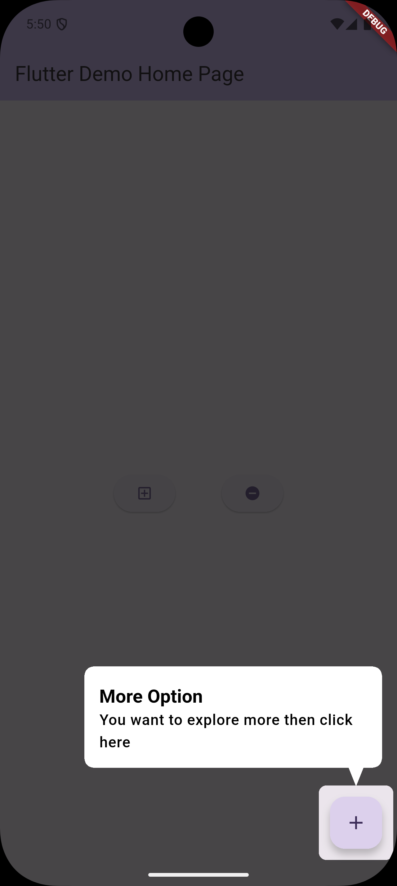

# Custom App Tour for Flutter

This package provides a **customizable in-app guided tour** for Flutter applications. It highlights UI elements with a transparent overlay and shows a speech bubble with descriptive text, helping guide users through your app’s features.

## ✨ Features

- **Highlight specific widgets** with a semi-transparent overlay.
- **Speech bubbles** with customizable text, position, and arrow direction.
- **Automatic scrolling** to bring target widgets into view.
- **Flexible positioning** (bubble appears above or below the target depending on available space).
- **Smooth transitions** between steps.

---

## 📂 Project Structure

| File                     | Description                                                                                         |
| ------------------------ | --------------------------------------------------------------------------------------------------- |
| `hole_overlay_view.dart` | Draws the darkened overlay with a transparent "hole" highlighting the target widget.                |
| `bubble_view.dart`       | Renders a customizable speech bubble with title, description, and an arrow pointing to the target.  |
| `custom_app_tour.dart`   | Core tour manager that handles showing steps, positioning bubbles, and navigating through the tour. |

---

## 🚀 Usage

### 1️⃣ Import the files

```dart
import 'bubble_view.dart';
import 'hole_overlay_view.dart';
import 'custom_app_tour.dart';
```

### 2️⃣ Assign `GlobalKey` to target widgets

```dart
final GlobalKey buttonKey = GlobalKey();
final GlobalKey cardKey = GlobalKey();
```

### 3️⃣ Attach the keys to your widgets

```dart
ElevatedButton(
  key: buttonKey,
  onPressed: () {},
  child: Text("Click Me"),
);
```

### 4️⃣ Define the tour steps

```dart
final steps = [
  TourStep(
    targetKey: buttonKey,
    title: "Welcome Button",
    description: "Tap here to start the onboarding process.",
  ),
  TourStep(
    targetKey: cardKey,
    title: "Info Card",
    description: "This section contains important updates.",
  ),
];
```

### 5️⃣ Start the tour

```dart
CustomAppTour(context: context, steps: steps).startTour();
```

---

## ⚙️ Customization

### Speech Bubble (`CustomSpeechBubble`)

- `` – Heading text.
- `` – Detail text.
- `` – Bubble width (default: `320`).
- `` – Arrow position relative to bubble width (0.0–1.0).
- `` – Whether bubble appears above or below the target.

### Overlay (`HoleOverlay`)

- `` – Position & size of the transparent hole.
- `` – Rounded corners for the hole (default: `8.0`).

---

## 📸 Example Screenshots



---

## 🛠️ Notes

- Works with **scrollable views** – the target widget is automatically scrolled into view.
- Call `startTour()` after the widget tree is built (e.g., inside a `postFrameCallback`).
- Clicking anywhere on the screen moves to the next step.
- The tour ends when all steps are shown.

---

## 📜 License

This project is provided under the **MIT License** – feel free to modify and use it in your own apps.

